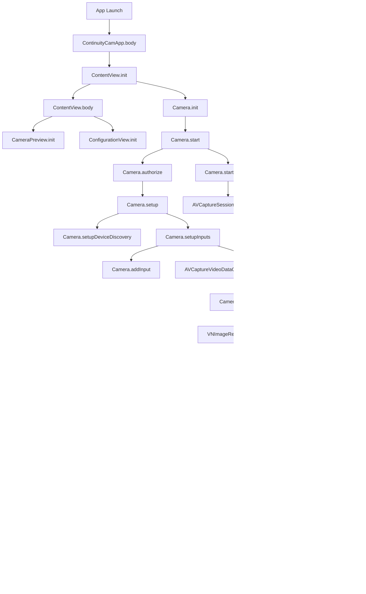

# Continuity Camera Mouse Tracker

## Project Overview

The Continuity Camera Mouse Tracker is an innovative application designed to revolutionize computer interaction for individuals with physical limitations, particularly those affected by carpal tunnel syndrome. By leveraging advanced camera technology and machine learning, this project aims to replace traditional physical input devices with intuitive gesture controls.

### Key Objectives

1. Develop a system using finger tracking and universal gesture control to:
   - Replace the physical mouse
   - Perform keyboard shortcuts
2. Reduce strain on hands and wrists by eliminating the need for traditional input devices
3. Provide an accessible solution for users with limited hand mobility

### Target Audience

- Individuals with carpal tunnel syndrome
- Designers and creative professionals
- Mechanical engineers working with CAD software
- Any professional requiring precise cursor control who struggles with traditional input devices

## Technology Stack

- **Swift**: Primary programming language
- **SwiftUI**: User interface framework
- **AVFoundation**: For camera and video processing
- **Vision**: For hand pose detection and tracking
- **Continuity Camera**: Utilizes iPhone as a high-quality camera for MacBooks

## Key Features

1. **Low-Latency Camera Feed Streaming**: 
   - Utilizes an iPhone's camera feed
   - Streams data to a MacBook via Bluetooth with minimal latency

2. **On-Device Processing**:
   - Leverages the computational power of Apple Silicon chips in MacBooks
   - Runs sophisticated machine learning models for real-time hand tracking

3. **Gesture-Based Control**:
   - Translates hand movements into cursor control
   - Supports custom gestures for various commands and shortcuts

## Project Architecture

### Core Components

1. **Camera Module** (`Camera.swift`)
   - Manages camera operations and video processing
   - Utilizes AVFoundation for seamless camera access and control

2. **Device Observers** (`DeviceObservers.swift`)
   - Monitors changes in camera effects and system preferences
   - Implements Key-Value Observing (KVO) for real-time updates

3. **Hand Pose Processor** (`HandPoseProcessor.swift`)
   - Utilizes Vision framework for hand pose detection
   - Translates hand movements into cursor control and gesture commands

### User Interface Components

- **ContentView** (`ContentView.swift`): Main SwiftUI view orchestrating the app's UI
- **CameraPreview** (`CameraPreview.swift`): Displays real-time camera feed
- **ConfigurationView** (`ConfigurationView.swift`): Allows users to configure camera and gesture settings
- **CursorFeedbackView** (`CursorFeedbackView.swift`): Provides visual feedback for cursor position

### Utility Components

- **MaterialView** (`MaterialView.swift`): Enhances UI with blurred, translucent effects
- **ContinuityCamApp** (`ContinuityCamApp.swift`): Defines the main application structure

## Application Flow

## Vision Framework Process Flow

## Key Challenges and Solutions

1. **Real-time Hand Pose Detection**
   - *Challenge*: Accurate and efficient hand tracking in real-time
   - *Solution*: Implemented Vision framework's VNDetectHumanHandPoseRequest

2. **Gesture-to-Command Translation**
   - *Challenge*: Interpreting hand gestures as mouse movements and keyboard shortcuts
   - *Solution*: Developed a robust gesture recognition system in HandPoseProcessor.swift

3. **Low-Latency Video Streaming**
   - *Challenge*: Minimizing delay between iPhone camera and MacBook processing
   - *Solution*: Optimized Bluetooth data transfer and leveraged Apple Silicon chip's processing power

4. **Accessibility-Focused UI**
   - *Challenge*: Creating an interface usable by individuals with limited hand mobility
   - *Solution*: Designed an intuitive, gesture-controlled configuration interface

## Future Improvements

1. Enhanced Gesture Recognition: Implement more complex gestures for advanced controls
2. Cross-Platform Support: Extend functionality to iOS and iPadOS
3. Depth and Infrared Integration: Utilize TrueDepth camera data for more precise tracking
4. Industry-Specific Modules: Develop specialized gesture sets for CAD software, video editing, etc.
5. Machine Learning Optimization: Continuously improve hand tracking accuracy and efficiency

## Getting Started

To run this project:

1. Ensure you have Xcode 14.0 or later installed
2. Clone the repository
3. Open the `.xcodeproj` file in Xcode
4. Build and run the project on a Mac running macOS 13.0 or later
5. Connect an iPhone or iPad running iOS 16.0 or later to use as a Continuity Camera

*Note: This project requires a Mac with Apple Silicon or Intel processor and an iOS device compatible with the Continuity Camera feature.*

## Contributing

We welcome contributions to the Continuity Camera Mouse Tracker project. Please read our CONTRIBUTING.md file for guidelines on how to submit pull requests, report issues, and suggest improvements.

## License

This project is licensed under the MIT License. See the LICENSE file for details.

## Acknowledgments

- Apple Inc. for providing the Vision framework and Continuity Camera feature
- The open-source community for inspiration and shared knowledge

## Contact

For questions, suggestions, or support, please open an issue in the GitHub repository or contact the project maintainers directly.
